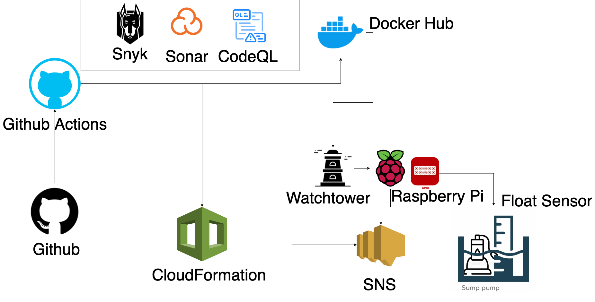
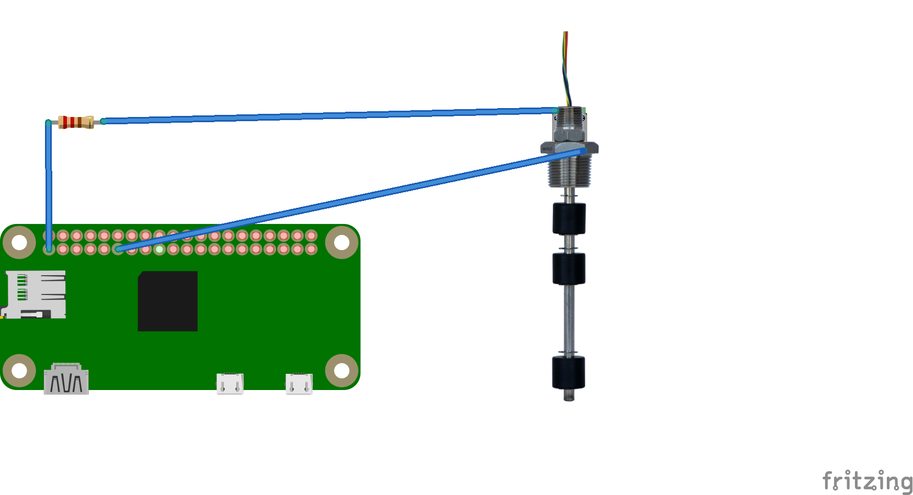
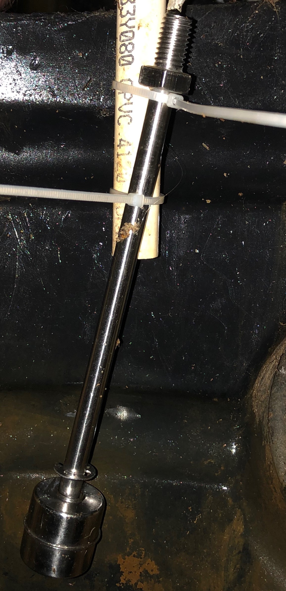

# Sump Level Sensor [](https://github.com/matthew-js-porter/sump-level-sensor/actions/workflows/python.yml)
Uses a Raspberry pi to monitor the water level in my sump and will send an alert when the water is higher than a certain threshold. 
The purpose of this tool is to be alerted in case of a sump pump failure so I can react before the basement is flooded. 

## Build

The Docker image can be built with the following command

```bash
python setup.py bdist_wheel && \
docker build . -t matthewjsporter/sump-level-sensor:latest
```

## Run

1. use `aws configure` to login to aws.
2. since this project relies on having GPIO pins, we can run locally by mocking the gpio pins using the `mocksump` entrypoint.

```bash
docker run -v ${HOME}/.aws:/root/.aws matthewjsporter/sump-level-sensor:latest mocksump
```

## Tests

Unit tests can be ran using setup.py

```bash
python setup.py test
```


## Deploy

Deployments are done through [github actions](.github/workflows/python.yml). The workflow will deploy the image to Dockerhub.
[Watchtower](https://hub.docker.com/r/v2tec/watchtower/) is deployed on the raspberry pi where it will automatically pull down the latest version and redeploy.
notifications are sent to a SNS message queue and is created using CloudFormation.

### Deployment Diagram
 

### Deploy from local
```bash
docker push matthewjsporter/sump-level-sensor:latest
```

### CloudFormation
cloudformation will run during the deployment pipeline but can be ran from local using the following command.
```bash
aws cloudformation update-stack --stack-name sump-level-sensor --template-body file://aws/cloudformation.yml --parameters  ParameterKey=EmailParameter,ParameterValue=<email> ParameterKey=SMSParameter,ParameterValue=<phone>
```

### Setup

One time installation on the raspberry pi is needed

1. Configure AWS credentials

```shell
sudo systemctl edit docker
```

and add the following content
```ini
[Service]
Environment="AWS_ACCESS_KEY_ID=<access-key>"
Environment="AWS_SECRET_ACCESS_KEY=<secret-key>"
```

add the following to `/home/pi/.profile`
```shell
export AWS_ACCESS_KEY_ID=<access-key>
export AWS_SECRET_ACCESS_KEY=<secret-key>
export AWS_DEFAULT_REGION=us-east-1
```

Use `docker compose` to start the containers

```shell
curl https://raw.githubusercontent.com/matthew-js-porter/sump-level-sensor/master/docker-compose.yml > docker-compose.yml
docker-compose up -d
```

after the initial installation is done, watchtower will install updates automatically.

## Code Scanning

### Snyk Image Scanning.

Docker image scanning is done using Snyk as part of the deployment pipeline and results can be viewed on the github action logs.
You can run a scan locally by running this command.
```bash
snyk test --file=Dockerfile --docker matthew-js-porter/sump-level-sensor:latest
```

### Snyk OSS Scanning

OSS image scanning is done using Snyk as part of the deployment pipeline and results can be viewed on the github action logs.
You can run a scan locally by running this command.
```bash
snyk monitor --file=sump_level_sensor.egg-info/requires.txt --package-manager=pip
```


### Sonar Scanning

Sonar scans are done as part of the deployment pipeline and results can be viewed on the github action logs.
Results can also be found on [Sonarcloud.](https://sonarcloud.io/dashboard?id=matthew-js-porter_sump-level-sensor)

## Hardware

* [Raspberry Pi Zero W](https://www.raspberrypi.org/products/raspberry-pi-zero-w/)
* [uxcell Float Switch Miniature Liquid Water Level Sensor](https://www.amazon.com/gp/product/B01LX1YOTP/ref=ppx_yo_dt_b_asin_title_o06_s01?ie=UTF8&psc=1)

### Circuit Design
 

Circuit design can be found in [circuit-diagram.fzz](circuit-diagram.fzz)

## Finished Product

